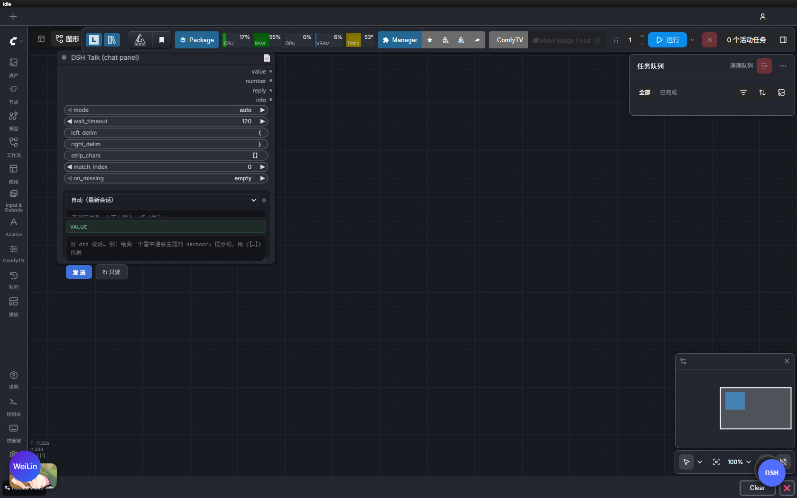

# ComfyUI-DSH-Receiver

在 ComfyUI 里直接和 **dsh（DeepSeek Harness）** 聊天，让 AI 现场写提示词，一键喂给生图流程。

不用再两个窗口来回跑：节点自带聊天面板，你说「给我一个雪中温泉主题的提示词，用【】包起来」，
dsh 回复后节点自动抓出包裹内容，`value` 直接接到 CLIPTextEncode 出图。



> Chat with dsh inside ComfyUI: the node sends your message to a running dsh web
> instance, waits for the reply, extracts the wrapped content (e.g. `{【2】}` → `2`)
> and pipes it into your prompt. English speakers: the node works the same, just
> write your message in English.

---

## 特性

- **节点即聊天窗**：会话选择、回复区、抓取结果高亮、输入框，全在节点上
- **三种工作模式**：面板发送后直接跑图（auto）/ 排队时强制重发（resend）/ 只读不发（read_only）
- **定界符自动回退**：配置找 `{}`，dsh 用了 `【】`？没关系——零命中时自动尝试 `【】 {} [] 「」 （） ()`
- **状态随工作流保存**：输入、回复、抓到的值、所选会话，重开工作流原样恢复
- **真实对话**：消息通过 dsh web 的官方 RPC 通道发出，dsh 网页 UI 里同步可见

## 原理

```
ComfyUI 节点面板
   │  POST /dsh/api/talk （ComfyUI 后端路由）
   ▼
dsh_bridge.py ──► POST http://127.0.0.1:3080/api/session/prompt  （与网页打字完全等效）
   │                鉴权：~/.dsh/dsh-web-*.state.json 里的 launch token 换 cookie
   ▼
轮询会话日志 ~/.dsh/sessions/<工作区>/<会话>/session.v3.jsonl.zstd
   │  按 requestId 锚定属于本轮的 turn，等到 turn/end completed
   ▼
抽取 {【…】} 内容 ──► value → CLIPTextEncode → 生图
```

两个实现要点：

- 会话日志是**多帧 zstd**（dsh 每次刷新追加一帧），单次解压只能拿到第一帧，
  本插件按帧流读取（973KB → 3.4MB / 681 条记录，约 0.01s）
- 等回复不依赖 WebSocket：以发送时的 `requestId` 为锚点轮询日志，
  即使消息排在别的任务后面也不会锚错到别人的回复

## 安装

前置条件：

- dsh 已安装且 `dsh web` 正在运行（默认 `http://127.0.0.1:3080`）
- ComfyUI 的 Python 环境里有 `zstandard`

```bash
cd ComfyUI/custom_nodes
git clone https://github.com/libolunm/ComfyUI-DSH-Receiver.git
# 给 ComfyUI 的 python 装依赖（路径按你的环境调整）
python -m pip install zstandard
```

**重启 ComfyUI**（新节点包必须重启才会被扫描到），画布双击搜 `DSH` 即可。

## 节点

### DSH Talk (chat panel) ★ 主力

分类 `dsh`。节点上直接对话：

1. 顶部下拉选会话（默认「自动（最新非空会话）」）
2. 底部输入框打字，`Ctrl+Enter` 或点「发送」
3. 回复区显示 dsh 回复，绿色高亮行是抓到的 `value`
4. 排队生图——`auto` 模式下直接用刚才那次回复，不会重复发消息

| 输出 | 类型 | 用途 |
|---|---|---|
| `value` | STRING | 抓到的内容，**接提示词节点** |
| `number` | INT | `value` 转整数（可接 seed），非数字为 0 |
| `reply` | STRING | dsh 回复全文（调试看） |
| `info` | STRING | 会话、匹配数、实际用的定界符（排查看） |

| 关键参数 | 默认 | 说明 |
|---|---|---|
| `mode` | `auto` | `auto` / `resend` / `read_only` |
| `session_id` | 空 | 钉死某个会话；空 = 最新非空会话 |
| `wait_timeout` | 120 | 等回复的最长秒数，dsh 跑长任务时调大 |
| `left/right_delim` | `{` `}` | 定界符（有自动回退，见下） |
| `strip_chars` | `【】` | 抓到后从两端剥掉的字符 |
| `match_index` | `0` | 多个匹配取第几个，`-1` = 最后一个 |
| `on_missing` | `empty` | 抓不到时：`empty` / `full_text` / `error` |

### DSH Reply Extractor

不发消息，只读 dsh 最新回复并抓取。用会话日志 mtime 做指纹，`IS_CHANGED` 自动刷新。
怕「最新会话」漂移（开了多个 dsh 窗口）就填 `session_file` 钉死日志绝对路径。

### DSH Latest Reply

只输出最新回复原文 + 长度 + 来源，调试用。

## 定界符

默认抓 `{【…】}`：`{【2】}` → `2`；`{【蓝发少女, 雪中温泉】}` → `蓝发少女, 雪中温泉`。

**自动回退**：配置的定界符零命中时，依次尝试 `【】` `{}` `[]` `「」` `（）` `()`，
用第一组命中的，`info` 里会标注 `auto-fallback` 及实际命中的定界符。
回退只在零命中时触发，不会抢配置优先权。

| dsh 回复写法 | left | right | strip | 输出 |
|---|---|---|---|---|
| `{【2】}` | `{` | `}` | `【】` | `2` |
| `【2】` | `【` | `】` | 空 | `2` |
| `<<42>>` | `<<` | `>>` | 空 | `42` |

## 排错

| 现象 | 检查 |
|---|---|
| 搜不到 DSH 节点 | 看 ComfyUI 启动日志有没有 `ComfyUI-DSH-Receiver`；`(IMPORT FAILED)` = 包内异常（多半是缺 `zstandard`） |
| `value` 空 | 看 `info` 输出；`⚠ NO MATCH` = 回复里没有任何可抓的包裹格式，把 `on_missing` 调成 `error` 可让错误显式中断 |
| 读错会话 | 默认取最新会话；多窗口并用时在下拉里选定，或填 `session_id` 钉死 |
| talk 超时 | dsh 正在跑长任务、消息在排队 → 调大 `wait_timeout` |

确认节点已注册：`http://127.0.0.1:8188/object_info/DSHTalk`
（新版 ComfyUI 的 `/object_info` 必须带节点名查询）

## 已知边界

- 消息是真实发进 dsh 会话的，**消耗 dsh 的 token**
- 只认回复里的 `text` 内容块；思考过程默认忽略
- 「最新会话」= `session/list` 里 updatedAt 最新的非空会话，跨工作区
- dsh web 的 RPC 接口来自对网页流量的逆向，dsh 升级后如有变动请提 issue

## License

MIT
